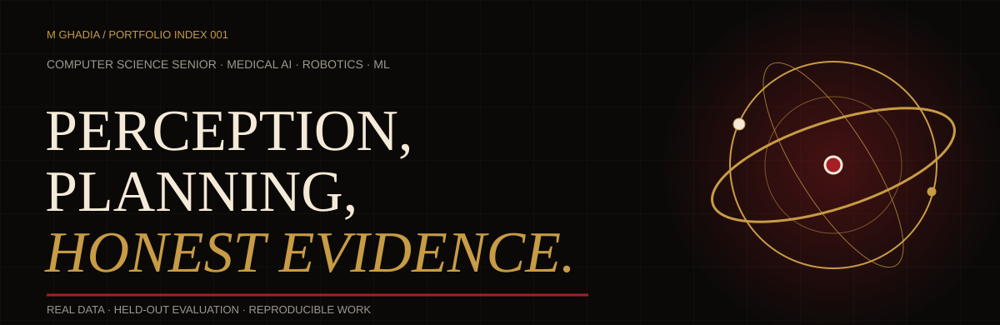
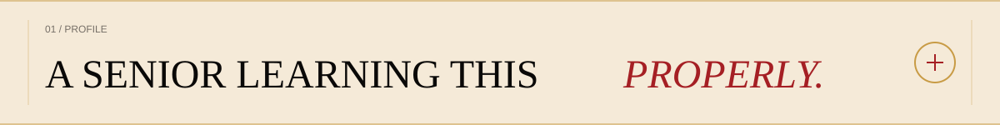
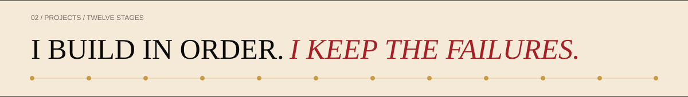
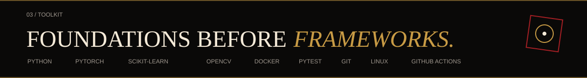

<!--
  GitHub profile README for github.com/mghadia1
  Copy this README.md and the assets/ folder into the mghadia1/mghadia1 repository.
-->

 

  

<code>COMPUTER SCIENCE SENIOR</code>&nbsp;&nbsp;·&nbsp;&nbsp;<code>MEDICAL AI</code>&nbsp;&nbsp;·&nbsp;&nbsp;<code>ROBOTICS</code>&nbsp;&nbsp;·&nbsp;&nbsp;<code>ML</code>

 

 

I'm a Computer Science senior at **Arizona State University** (GPA **3.55**, graduating **December 2027**) focused on medical AI, robotics, machine learning, and deep learning.

I learn by implementing things from scratch first, then reading the theory, then explaining it back in my own words. A topic isn't finished until I can defend it.

<table>
<tr>
<td width="33%" valign="top">

#### What I build

Medical-image segmentation, predictive maintenance, retrieval systems, model adaptation, and robotics simulation.

</td>
<td width="34%" valign="top">

#### How I work

Real or public data, held-out evaluation, reproducible pipelines, and write-ups that preserve what failed.

</td>
<td width="33%" valign="top">

#### What I'm seeking

A 2027 internship in medical AI, robotics, computer vision, machine learning, or applied AI engineering.

</td>
</tr>
</table>

 

 

These twelve projects form a deliberate sequence—not a pile of demos. Each one teaches what the next one needs: gradients before frameworks, an explainable vision baseline before a neural network, kinematics before integration, and a fine-tuned classifier before a 7B model is adapted or an agent is handed tools.

<table>
<tr>
<td width="50%" valign="top">

### 01 · [surgiseg-ml](https://github.com/mghadia1/surgiseg-ml)

**Medical-image segmentation on real data**

U-Net segmentation on Kvasir-Instrument endoscopy images, evaluated against an untouched publisher test set. The score drop stays in the record; the recovery was earned without moving the threshold.

`PyTorch` `NumPy` `Docker`

**Held-out Dice: 0.9226**

</td>
<td width="50%" valign="top">

### 02 · [sensorguard-ml](https://github.com/mghadia1/sensorguard-ml)

**Leakage-aware predictive maintenance**

An evaluation-first pipeline on the public UCI AI4I dataset, using average precision for an imbalanced target and keeping preprocessing inside the split.

`scikit-learn` `PyTorch` `pandas`

**Measured for imbalance, not accuracy theater**

</td>
</tr>
<tr>
<td width="50%" valign="top">

### 03 · [medbot-vision](https://github.com/mghadia1/medbot-vision)

**Explainable perception before deep learning**

Classical CV detection, connected components, homography, and camera calibration built as a transparent baseline for later robotics work.

`OpenCV` `NumPy` `geometry`

**Every transformation can be inspected**

</td>
<td width="50%" valign="top">

### 04 · [medbot-assist](https://github.com/mghadia1/medbot-assist)

**Vision-to-planning robotics integration**

A simulation-first system connecting detections, transforms, safety gates, and planar planning—with safe rejections reported as outcomes, not hidden as errors.

`vision` `planning` `simulation`

**The system is allowed to say “not safe”**

</td>
</tr>
</table>

### The full sequence

| Stage | Project | What it establishes |
|:--:|---|---|
| 01 | [optimization-lab](https://github.com/mghadia1/optimization-lab) | Linear and logistic regression from scratch in NumPy |
| 02 | [medbot-vision](https://github.com/mghadia1/medbot-vision) | Explainable detection, calibration, and geometry |
| 03 | [surgiseg-ml](https://github.com/mghadia1/surgiseg-ml) | U-Net segmentation on real endoscopy images |
| 04 | [sensorguard-ml](https://github.com/mghadia1/sensorguard-ml) | Leakage-aware evaluation on imbalanced public data |
| 05 | [papertrail-rag](https://github.com/mghadia1/papertrail-rag) | Grounded retrieval over real ML and CS papers |
| 06 | [textforge-finetune](https://github.com/mghadia1/textforge-finetune) | Fine-tuning against a meaningful baseline |
| 07 | [loraforge-llm](https://github.com/mghadia1/loraforge-llm) | QLoRA adaptation with frozen evaluation |
| 08 | [experiment-orchestrator](https://github.com/mghadia1/experiment-orchestrator) | A tool-using experiment agent with typed tools |
| 09 | [wardnav](https://github.com/mghadia1/wardnav) | A*, obstacle inflation, replanning, and noisy localization |
| 10 | [surgiarm-sim](https://github.com/mghadia1/surgiarm-sim) | FK/IK, collision checking, RRT, and pick-and-place |
| 11 | [medbot-assist](https://github.com/mghadia1/medbot-assist) | Integrated perception, safety, and planning |
| 12 | [resume-radar](https://github.com/mghadia1/resume-radar) | Deterministic scoring and ranking automation |

Full case studies, methodology, and evidence are on <a href="https://mayank-ghadia.vercel.app">the portfolio</a>.

 

 

| Layer | Tools |
|---|---|
| **Languages** | Python · Java · JavaScript · HTML · CSS |
| **ML & data** | PyTorch · scikit-learn · NumPy · pandas · OpenCV |
| **Engineering** | Docker · GitHub Actions · pytest · Git · Linux |
| **Working areas** | Computer vision · RAG · fine-tuning · robotics simulation · applied AI |

 

### Activity / evidence of work

 

 

**Open to summer, fall, and spring internships in medical AI, robotics, machine learning, and deep learning.**

<a href="https://github.com/mghadia1">GitHub</a>&nbsp;&nbsp;·&nbsp;&nbsp;<a href="https://linkedin.com/in/mayank-ghadia">LinkedIn</a>&nbsp;&nbsp;·&nbsp;&nbsp;<a href="mailto:mghadia1@asu.edu">Email</a>&nbsp;&nbsp;·&nbsp;&nbsp;<a href="https://mayank-ghadia.vercel.app">Portfolio</a>

 

REAL DATA · HELD-OUT EVALUATION · HONEST WRITE-UPS · REPRODUCIBLE REPOS

